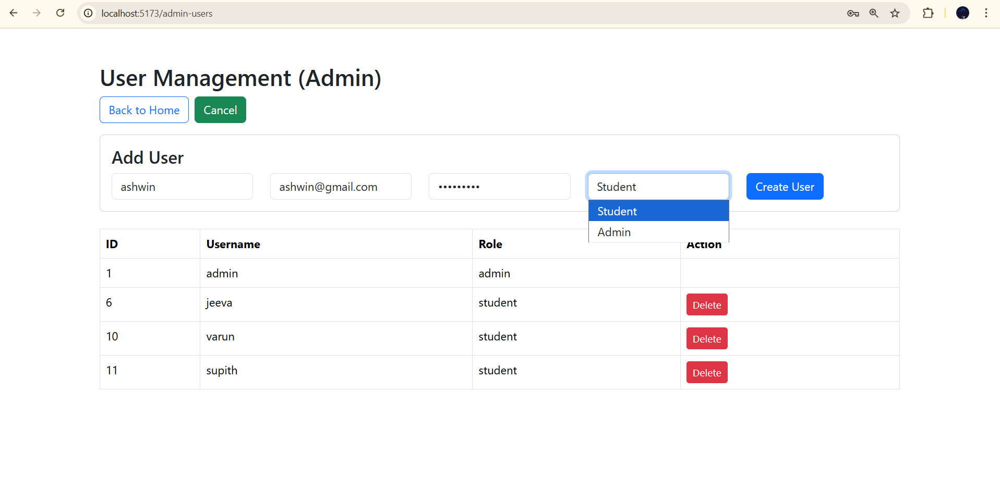
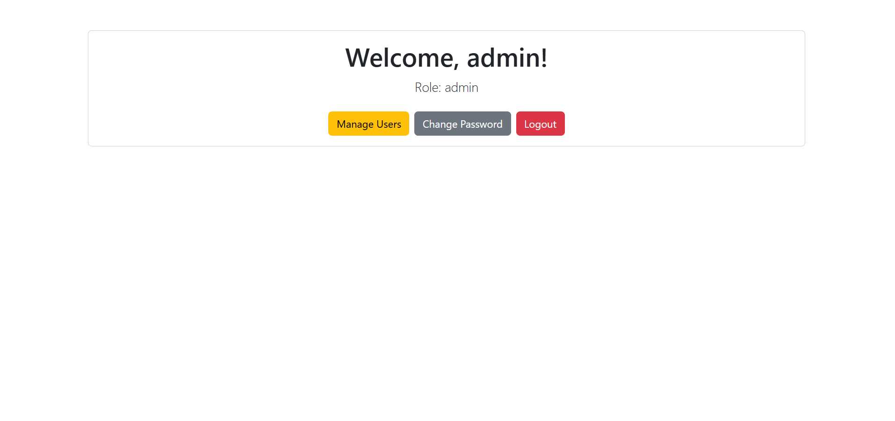
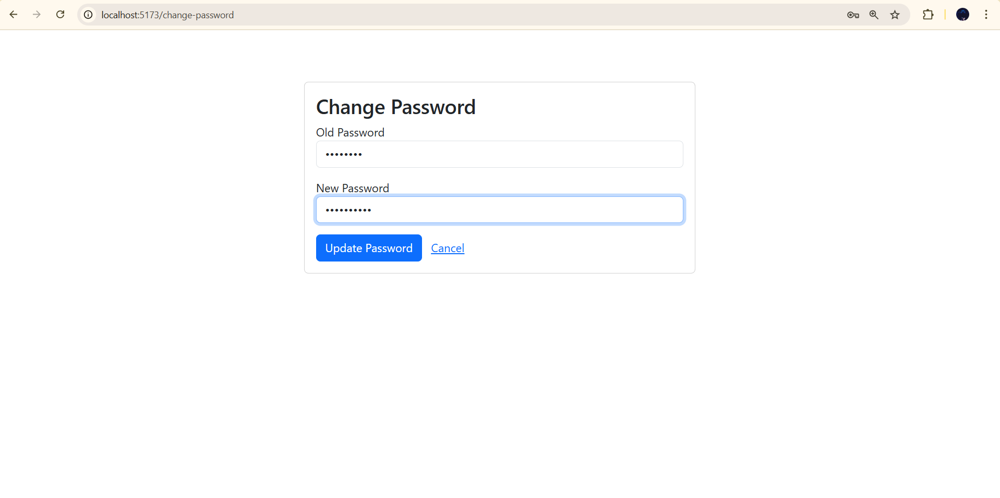

# Role-Based User Management System

This is a simple web application for managing users with different roles (Admin and Student). It uses Django for the backend and React for the frontend.

## Technologies Used
*   **Backend:** Django, Django REST Framework
*   **Database:** MySQL
*   **Frontend:** React, Bootstrap
*   **Tools:** Vite, Axios

## Prerequisites
*   Python installed
*   Node.js installed
*   MySQL Server (e.g., XAMPP or WAMP) running

## Screenshots

### Login Page


### Student Registration


### Home Page (Welcome)


### Admin Dashboard (User List)


### Admin Add User


### Change Password


## Setup Instructions

### 1. Database Setup
Make sure your MySQL server is running. The project is configured to use a database named `student_db` with user `root` and password `1979`. If you need to change this, edit `backend/myproject/settings.py`.

### 2. Backend Setup
Open a terminal and navigate to the `backend` folder:

```bash
cd backend
```

Create a virtual environment (if not already created):

```bash
python -m venv venv
```

Activate the virtual environment:
*   Windows: `venv\Scripts\activate`
*   Mac/Linux: `source venv/bin/activate`

Install dependencies:

```bash
pip install django djangorestframework mysqlclient django-cors-headers
```

Create the database (if not exists):

```bash
python create_db.py
```

Run migrations:

```bash
python manage.py migrate
```

Create the Admin user (auto-script):

```bash
python seed_admin.py
```
*This creates an admin with username: `admin` and password: `admin123`*

Start the server:

```bash
python manage.py runserver
```
The backend will run at `http://127.0.0.1:8000`.

### 3. Frontend Setup
Open a new terminal and navigate to the `frontend` folder:

```bash
cd frontend
```

Install dependencies:

```bash
npm install
```

Start the development server:

```bash
npm run dev
```
The frontend will run at `http://localhost:5173`.

## Usage Guide

### Admin User
*   **Login:** Use username `admin` and password `admin123`.
*   **Features:**
    *   View list of all registered users.
    *   Delete users.
    *   Change own password.

### Student User
*   **Registration:** Go to the Register page to create a new account.
*   **Login:** Use your registered credentials.
*   **Features:**
    *   View Welcome page.
    *   Change password.
    *   *Note: Students cannot see the "Manage Users" button.*

## Important Notes
*   **CORS:** Cross-Origin Resource Sharing is enabled to allow the React frontend to talk to the Django backend.
*   **Security:** This is a simple educational project. In a real production app, never hardcode database passwords or secrets!.
*   **Validation:** Basic validation is included (e.g., password length, unique usernames)

